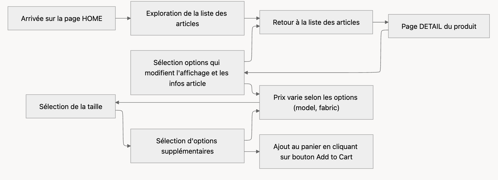
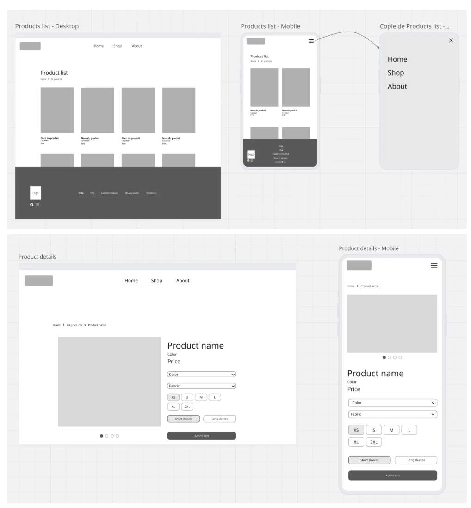
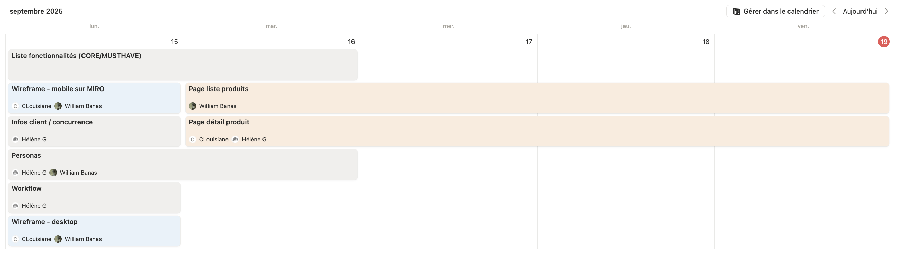

# Luxury Woven Heritage (LWH)


## Équipe (Agence Web)

- **Louisiane C** — Web Developer
- **William B** — Web Developer
- **Hélène G** — Gestion de projet / Web Developer

## Client

**Luxury Woven Heritage** (*Héritage Tissé de Luxe - client fictif*) est une marque bicentenaire spécialisée dans la personnalisation de vêtements de luxe. Notre projet consiste en un configurateur e-commerce permettant aux clients de **personnaliser des t-shirts de luxe avec un aperçu en temps réel et un calcul de prix dynamique.**

## Objectifs

- Personnaliser un produit de luxe (taille/couleur/manches/tissu)
- Afficher un aperçu en temps réel
- Calculer un prix dynamique selon les options

## Démarrage

- **Pré-requis**: un serveur statique (extension Live Server)
- **Lancement**:
    - ouvrir frontend/index.html avec Live Server

## Technologies

- **HTML**
- **CSS**
- **JavaScript** (vanilla)

## Structure

```
LUXURY-WOVEN-HERITAGE
└─ frontend
   ├─ assets
   │  ├─ icons
   │  └─ images
   ├─ css
   │  ├─ product.css
   │  ├─ reset.css
   │  └─ styles.css
   ├─ js
   │  ├─ index.js
   │  └─ product.js
   ├─ index.html
   ├─ product.html
   ├─ .gitignore
   ├─ logo.png
   └─ README.md
```

## Charte graphique

- **Couleurs**
    - White Smoke: `#F5F5F5`
    - Eerie Black: `#1F1F1F`
    - Sandy Brown: `#EE964B`
- **Typographie**
    - Manrope

## Fonctionnalités

- **Personnalisation**
    - **Taille**: XS à 2XL
    - **Couleur**: Black, White, Sandy Brown
    - **Manches**: Short, Long
    - **Tissu**:
        - Cotton Silk,
        - Cotton Pima,
        - Cotton Sea Island
- **Titre produit**
    - THE CLASSIC — SHORT SLEEVES
    - THE CLASSIC — LONG SLEEVES
- **Prix dynamique**
    - Base: 1199 € (Short + Cotton Silk)
    - +300 € si Long
    - +1000 € si Cotton Pima
    - +1500 € si Cotton Sea Island
- **Validation taille obligatoire**
    - Bouton Add to cart désactivé tant qu’aucune taille n’est choisie
- **Catalogue d’images**
    - Référentiel d’images par variante (short/long × couleur)
- **UX**
    - Carousel images, sélecteurs, chips de taille, état visuel synchronisé

## Workflow (MermaidJS)



## Wireframe (Miro)



## Organisation



## Fonctionnalités

### Titre dynamique

```jsx
jsfunction composeTitleAndDesc() {
  const fixedTitle = state.sleeveType === "short"
    ? "THE CLASSIC - SHORT SLEEVES"
    : "THE CLASSIC - LONG SLEEVES";
  const fabric = fabricData[state.fabricKey];
  const description = fabric?.description || "Premium cotton knit with a comfortable fit.";
  return { title: fixedTitle, description };
}
```

### Prix dynamique

```jsx
jsconst BASE_PRICE = 1199;
const FABRIC_UPCHARGE_EUR = {
  "cotton silk": 0,
  "cotton pima": 1000,
  "cotton sea island": 1500
};
const SLEEVE_UPCHARGE_EUR = { short: 0, long: 500 };

function computePriceEUR({ sleeveType, fabricKey }) {
  return BASE_PRICE
    + (FABRIC_UPCHARGE_EUR[fabricKey] || 0)
    + (SLEEVE_UPCHARGE_EUR[sleeveType] || 0);
}
```

### État et persistance

- **Clé de stockage**: productState
- **Champs**:
    - sleeveType,
    - colorKey,
    - fabricKey,
    - selectedSize,
    - priceEUR
- **Rôle**: réhydrater l’UI à chaque chargement (POC)

### Add to cart (démo)

- Comportement: log du payload + notification/toast
- Pas de panier persistant
- **Statut**: POC front; état produit en localStorage, “Add to cart” non persistant (toast/log)


